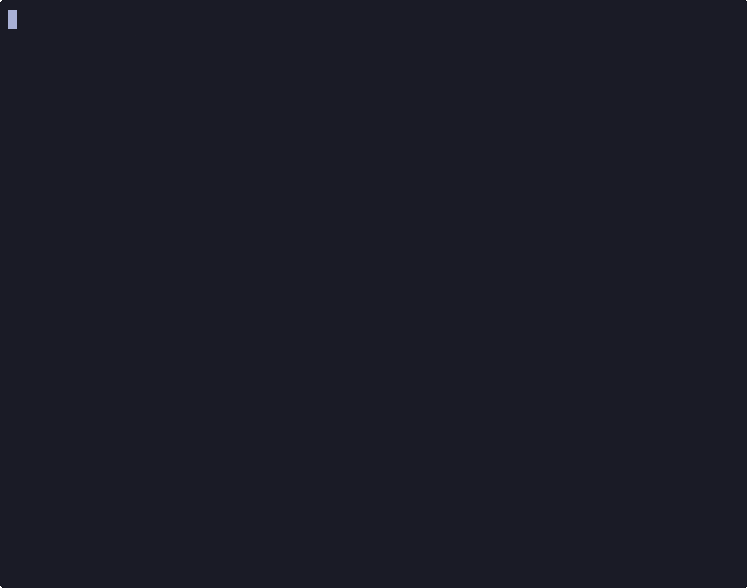

# Tetris

Este projeto é uma implementação do clássico jogo **Tetris**, desenvolvida em **C#** como parte de um trabalho para a disciplina de Algoritmos e Técinas de Programação no curso de Sistemas de Informação da PUC Minas.

O principal objetivo deste trabalho foi aplicar os conceitos básicos de linguagens  linguagens de programação como vetores, matrizes, estruturas de controle e repetição, métodos e interação com o usuário via console.

## Demonstração



## 🧩 Funcionalidades

- Geração aleatória de peças (Tetrominos)
- Rotação e movimentação lateral
- Detecção de colisões e preenchimento de linhas
- Sistema de pontuação

## 🛠️ Requisitos

- [.NET SDK 8.0 ou superior](https://dotnet.microsoft.com/download)
- Editor recomendado: [Visual Studio](https://visualstudio.microsoft.com/) ou [Visual Studio Code](https://code.visualstudio.com/)
- Sistema operacional: Windows e Linux

## 🚀 Como compilar e executar

### Usando o terminal (CLI)

1. Clone o repositório:

```sh
git clone https://github.com/mateusjdev/psg-si-tetris
cd psg-si-tetris
```

2. Compile o projeto:

```sh
dotnet build
```

3. Execute o jogo:
```sh
dotnet run
```
